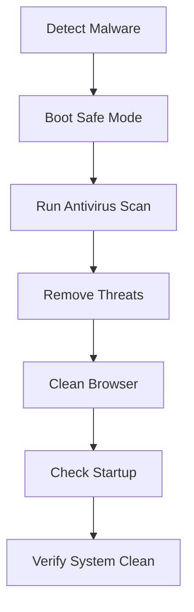

# 🛠️ IT Helpdesk Quick Reference Guide
## Hướng Dẫn Nhanh Hỗ Trợ Kỹ Thuật IT

> **Version:** 1.0 | **Last Updated:** November 1, 2025  
> **Language:** Bilingual (English/Vietnamese)

---

## 📑 Table of Contents

- [Network Troubleshooting](#-network-troubleshooting--khắc-phục-sự-cố-mạng)
- [Security & Antivirus](#-security--antivirus--bảo-mật--diệt-virus)
- [Data Backup & Recovery](#-data-backup--recovery--sao-lưu--khôi-phục-dữ-liệu)
- [Hardware Issues](#-hardware-issues--sự-cố-phần-cứng)
- [Windows Troubleshooting](#-windows-troubleshooting--khắc-phục-sự-cố-windows)
- [Quick Commands](#-quick-commands--lệnh-nhanh)
- [Keyboard Shortcuts](#-keyboard-shortcuts--phím-tắt)

---

## 🌐 Network Troubleshooting / Khắc Phục Sự Cố Mạng

### ❌ No Internet Connection / Không Có Kết Nối Internet

**Severity:** 🔴 High | **Estimated Time:** 10-20 minutes

#### Step-by-Step Solution / Giải Pháp Từng Bước

| Step | Action (English) | Hành Động (Tiếng Việt) |
|------|------------------|------------------------|
| **1** | Check physical connections | Kiểm tra kết nối vật lý |
| **2** | Restart network devices | Khởi động lại thiết bị mạng |
| **3** | Check IP configuration | Kiểm tra cấu hình IP |
| **4** | Test connectivity | Kiểm tra kết nối |
| **5** | Change DNS servers | Thay đổi DNS servers |

#### Detailed Steps / Chi Tiết

**Step 1: Check Physical Connections**
```
✓ Ensure all cables are securely connected
✓ Check router indicator lights (power, internet, WiFi)
✓ Try a different Ethernet cable if using wired connection
✓ Verify WiFi is enabled (check physical switch or Fn key)
```

**Step 2: Restart Network Devices**
```bash
# Power cycle procedure:
1. Unplug modem power → wait 30 seconds → plug back in
2. Unplug router power → wait 30 seconds → plug back in
3. Restart your computer
4. Wait 2-3 minutes for all devices to fully boot
```

**Step 3: Check IP Configuration**
```cmd
# Open Command Prompt and run:
ipconfig /all

# If IP address starts with 169.254.x.x (invalid), run:
ipconfig /release
ipconfig /renew
ipconfig /flushdns
```

**Step 4: Test Connectivity**
```cmd
# Test your router
ping 192.168.1.1

# Test external DNS
ping 8.8.8.8

# Test domain name resolution
ping google.com
```

**Step 5: Change DNS Servers**
```
Settings > Network & Internet > Change adapter options
→ Right-click adapter → Properties → IPv4 → Properties

Use these DNS servers:
• Google DNS: 8.8.8.8 (Primary), 8.8.4.4 (Secondary)
• Cloudflare: 1.1.1.1 (Primary), 1.0.0.1 (Secondary)
```

#### Common Causes / Nguyên Nhân Phổ Biến

- ⚠️ ISP outage / Nhà cung cấp dịch vụ gặp sự cố
- ⚠️ Router configuration issues / Vấn đề cấu hình router
- ⚠️ Faulty network cable / Dây mạng bị lỗi
- ⚠️ DNS problems / Vấn đề DNS
- ⚠️ IP conflict / Xung đột địa chỉ IP

---

### 🐌 Slow Internet Speed / Tốc Độ Internet Chậm

**Severity:** 🟡 Medium | **Estimated Time:** 15-30 minutes

#### Quick Diagnostics / Chẩn Đoán Nhanh

1. **Run Speed Test** 🏃
   - Visit: [speedtest.net](https://speedtest.net) or [fast.com](https://fast.com)
   - Compare with your ISP's advertised speed
   - Test multiple times at different hours

2. **Check Bandwidth Usage** 📊
   ```
   Open Task Manager (Ctrl + Shift + Esc)
   → Performance tab → Network
   → Identify apps using high bandwidth
   ```

3. **Optimize WiFi** 📡
   - Place router in central location
   - Keep away from walls and metal objects
   - Reduce interference from other devices
   - Use 5GHz band for faster speeds (shorter range)

4. **Update Router Firmware** 🔄
   - Check manufacturer website for latest firmware
   - Access router admin panel (usually 192.168.1.1)
   - Apply updates and restart

#### Common Solutions / Giải Pháp

| Issue | Solution |
|-------|----------|
| Too many devices | Disconnect unused devices, use QoS settings |
| Background downloads | Pause Windows Update, cloud sync services |
| Outdated drivers | Update network adapter drivers |
| WiFi interference | Change WiFi channel in router settings |

---

## 🔒 Security & Antivirus / Bảo Mật & Diệt Virus

### 🦠 Malware Infection / Nhiễm Malware

**Severity:** 🔴 Critical | **Estimated Time:** 1-3 hours

#### Emergency Response / Phản Ứng Khẩn Cấp



#### Step 1: Boot into Safe Mode / Khởi Động Safe Mode

**Windows 10/11:**
```
Settings → Update & Security → Recovery
→ Advanced startup → Restart now
→ Troubleshoot → Advanced options → Startup Settings → Restart
→ Press F4 (Safe Mode) or F5 (Safe Mode with Networking)
```

**Alternative Method:**
```
Hold Shift key while clicking Restart
```

#### Step 2: Run Full Antivirus Scan / Quét Virus Toàn Bộ

**Windows Defender:**
```
Windows Security → Virus & threat protection
→ Scan options → Full scan → Scan now
```

**Additional Tools:** (Tải xuống trong Safe Mode với mạng)
- ✅ **Malwarebytes** - Excellent malware removal
- ✅ **HitmanPro** - Secondary opinion scanner
- ✅ **AdwCleaner** - Remove adware and PUPs
- ✅ **RogueKiller** - Advanced malware removal

#### Step 3: Remove Suspicious Programs / Gỡ Chương Trình Đáng Ngờ

```
Control Panel → Programs and Features
→ Sort by "Installed On" (installation date)
→ Look for unfamiliar programs installed recently
→ Uninstall suspicious programs
```

**Red Flags:** 🚩
- Programs you don't remember installing
- Names with random characters or typos
- No publisher information
- Installed same day as infection

#### Step 4: Reset Browser Settings / Đặt Lại Trình Duyệt

**Google Chrome:**
```
Settings → Reset settings → Restore settings to their original defaults
→ Extensions → Remove suspicious extensions
```

**Microsoft Edge:**
```
Settings → Reset settings → Restore settings to default values
```

**Clear browsing data:**
```
Ctrl + Shift + Delete → Select "All time" → Clear data
```

#### Step 5: Check Startup Programs / Kiểm Tra Khởi Động

```cmd
# Open Task Manager
Ctrl + Shift + Esc → Startup tab

# Or use System Configuration
Win + R → type "msconfig" → Startup tab
→ Disable suspicious entries
```

#### Prevention Tips / Phòng Ngừa

| ✅ Do | ❌ Don't |
|-------|----------|
| Keep antivirus updated | Click suspicious links |
| Download from trusted sources only | Download cracked software |
| Enable Windows Defender | Disable firewall |
| Regular security scans | Open unknown email attachments |
| Use strong passwords | Share passwords |
| Enable 2FA everywhere | Ignore security warnings |

---

### 🎣 Phishing Attack Recognition / Nhận Biết Lừa Đảo

#### 🚨 Red Flags / Dấu Hiệu Cảnh Báo

```yaml
Suspicious Email Indicators:
  ⚠️ Urgent action required
  ⚠️ Request for personal information
  ⚠️ Generic greetings ("Dear Customer", "Dear User")
  ⚠️ Misspelled domain names (microsof.com vs microsoft.com)
  ⚠️ Unexpected attachments
  ⚠️ Too good to be true offers
  ⚠️ Spelling and grammar errors
  ⚠️ Mismatched sender name and email address
```

#### 🛡️ Response Actions / Hành Động Phản Ứng

1. **DO NOT:**
   - ❌ Click any links in the email
   - ❌ Download attachments
   - ❌ Reply to the sender
   - ❌ Provide any personal information

2. **DO:**
   - ✅ Hover over links to see actual URL
   - ✅ Verify sender's email address
   - ✅ Contact sender through official channels
   - ✅ Report to IT Security
   - ✅ Delete the email
   - ✅ Change passwords if compromised

3. **If Compromised:**
   ```
   1. Immediately change all passwords
   2. Enable 2FA on all accounts
   3. Monitor bank/credit card statements
   4. Report to IT Security
   5. Run full antivirus scan
   ```

---

## 💾 Data Backup & Recovery / Sao Lưu & Khôi Phục Dữ Liệu

### 📋 The 3-2-1 Backup Rule

```
╔══════════════════════════════════════╗
║  3  copies of your data              ║
║  2  different storage media types    ║
║  1  offsite/cloud backup             ║
╚══════════════════════════════════════╝
```

### 📊 Backup Types Comparison

| Type | Description | Frequency | Speed | Storage |
|------|-------------|-----------|-------|---------|
| **Full** | Complete copy of all data | Weekly/Monthly | Slow | High |
| **Incremental** | Changed files since last backup | Daily | Fast | Low |
| **Differential** | Changed since last full backup | 2-3x/week | Medium | Medium |

### 🪟 Windows Backup Solutions

#### 1. File History (Built-in)

```
Settings → Update & Security → Backup
→ Add a drive → Select external drive
→ More options → Back up now
```

**What it backs up:**
- 📁 Documents
- 🖼️ Pictures
- 🎬 Videos
- 🎵 Music
- 🖥️ Desktop

#### 2. System Image Backup

```
Control Panel → Backup and Restore (Windows 7)
→ Create a system image
→ Select destination (external drive/network)
→ Start backup
```

**What it backs up:**
- Everything! Complete Windows installation
- All programs and settings
- Perfect for disaster recovery

#### 3. OneDrive Cloud Backup

```
Sign in to OneDrive
→ Settings → Backup → Manage backup
→ Select folders to backup
```

**Features:**
- ☁️ 5GB free storage
- 📱 Access from anywhere
- 🔄 Automatic sync
- 📝 File versioning (30 days)

### 💼 Cloud Backup Services

| Service | Cost | Storage | Features |
|---------|------|---------|----------|
| **Backblaze** | $7/month | Unlimited | Continuous backup, easy restore |
| **Carbonite** | $6-24/month | Varies | Personal & business plans |
| **IDrive** | $52.12/year | 5TB | Multiple devices, server backup |
| **Google Drive** | $1.99/month | 100GB | Integration with Google services |

### 🔄 Data Recovery Steps

```bash
# If files were deleted recently:
1. Check Recycle Bin
2. Use File History: Right-click folder → Restore previous versions
3. Check OneDrive online (if synced)

# If hard drive failed:
1. Stop using the drive immediately
2. Use data recovery software:
   - Recuva (Free)
   - EaseUS Data Recovery
   - TestDisk (Free, advanced)
3. Professional recovery service (expensive)
```

---

## 🖥️ Hardware Issues / Sự Cố Phần Cứng

### 💻 Computer Won't Start / Máy Không Khởi Động

**Severity:** 🔴 Critical

#### Quick Checklist ✓

```
□ Check power cable connection
□ Try different power outlet
□ Look for LED indicators
□ Listen for fans/hard drive sounds
□ Check for beep codes
□ Remove external devices
□ Try with battery removed (laptops)
```

#### Troubleshooting Steps

**1. Power Supply Test**
```
Desktop:
- Check power supply switch (on back of PC)
- Test with different power cable
- Listen for power supply fan

Laptop:
- Try AC adapter only (remove battery)
- Check AC adapter LED light
- Try different outlet
```

**2. Hard Reset**
```
1. Unplug power cable (and remove battery for laptops)
2. Hold power button for 30 seconds
3. Reconnect power (leave battery out initially)
4. Try to power on
```

**3. BIOS Beep Codes**

| Beeps | Meaning | Action |
|-------|---------|--------|
| 1 short | Normal POST | System OK |
| 2 short | POST error | Check screen for message |
| 3 short | Memory error | Reseat RAM |
| Continuous | Memory error | Replace RAM |
| Long beeps | Graphics card issue | Reseat GPU |

---

## 🪟 Windows Troubleshooting / Khắc Phục Sự Cố Windows

### 🐢 Slow Computer Performance / Máy Chạy Chậm

#### Quick Fixes (5-10 minutes)

```powershell
# 1. Restart your computer (if uptime > 7 days)
shutdown /r /t 0

# 2. Check disk space (need 20% free on C:)
# Delete temporary files:
cleanmgr /d C:

# 3. Disable startup programs
# Ctrl + Shift + Esc → Startup tab → Disable unnecessary programs

# 4. Update Windows
# Settings → Update & Security → Check for updates
```

#### Deep Clean (30-60 minutes)

1. **Run Disk Cleanup**
   ```
   Win + R → cleanmgr → OK
   → Clean up system files
   → Select all checkboxes → OK
   ```

2. **Optimize Drives**
   ```
   Defragment and Optimize Drives
   → Select C: → Optimize
   (Note: SSDs don't need defragmentation)
   ```

3. **Check for Malware**
   ```
   Windows Security → Full scan
   ```

4. **Update Drivers**
   ```
   Device Manager → Check for yellow exclamation marks
   → Right-click → Update driver
   ```

---

## ⌨️ Quick Commands / Lệnh Nhanh

### Network Commands

```cmd
# Display IP configuration
ipconfig /all

# Release and renew IP
ipconfig /release
ipconfig /renew

# Flush DNS cache
ipconfig /flushdns

# Test connectivity
ping 8.8.8.8
ping google.com

# Trace route to destination
tracert google.com

# Show WiFi profiles
netsh wlan show profiles

# Show WiFi password
netsh wlan show profile name="WiFiName" key=clear
```

### System Commands

```cmd
# System File Checker (repairs Windows files)
sfc /scannow

# Check disk for errors
chkdsk C: /f /r

# System information
systeminfo

# Open System Configuration
msconfig

# Open Device Manager
devmgmt.msc

# Open Computer Management
compmgmt.msc

# Open Event Viewer
eventvwr.msc
```

### Performance Commands

```cmd
# Open Task Manager
taskmgr

# Open Resource Monitor
resmon

# Open Performance Monitor
perfmon
```

---

## ⌨️ Keyboard Shortcuts / Phím Tắt

### Essential Windows Shortcuts

| Shortcut | Action | Mô Tả |
|----------|--------|-------|
| `Win + L` | Lock computer | Khóa máy tính |
| `Ctrl + Shift + Esc` | Task Manager | Mở Task Manager |
| `Win + I` | Settings | Mở Settings |
| `Win + E` | File Explorer | Mở File Explorer |
| `Win + R` | Run dialog | Hộp thoại Run |
| `Win + S` | Search | Tìm kiếm |
| `Win + Tab` | Task View | Xem tác vụ |
| `Alt + Tab` | Switch apps | Chuyển ứng dụng |
| `Alt + F4` | Close window | Đóng cửa sổ |
| `Ctrl + Shift + Delete` | Clear browser data | Xóa dữ liệu trình duyệt |

### Advanced Shortcuts

| Shortcut | Action |
|----------|--------|
| `Win + X` | Quick access menu |
| `Win + .` | Emoji picker |
| `Win + V` | Clipboard history |
| `Win + Shift + S` | Screenshot tool |
| `Win + PrtScn` | Save screenshot |

---

## 📞 IT Support Contact / Liên Hệ Hỗ Trợ

### 🆘 Helpdesk Information

```yaml
Email: helpdesk@company.com
Phone: Internal ext. 1234
Portal: https://helpdesk.company.com
Hours: Monday-Friday, 8:00 AM - 6:00 PM
Emergency: 24/7 for critical issues
```

### 📋 Service Level Agreements (SLA)

| Priority | Response Time | Resolution Time |
|----------|---------------|-----------------|
| 🔴 **P1 - Critical** | 1 hour | 4 hours |
| 🟠 **P2 - High** | 4 hours | 1 business day |
| 🟡 **P3 - Medium** | 1 business day | 3 business days |
| 🟢 **P4 - Low** | 2 business days | 5 business days |

---

## 📚 Additional Resources / Tài Nguyên Bổ Sung

- 📖 **Knowledge Base:** https://kb.company.com
- 🎓 **Training Videos:** https://training.company.com
- ❓ **FAQ:** https://faq.company.com
- 💬 **Community Forum:** https://forum.company.com

---

<div align="center">

**Document Version:** 1.0  
**Last Updated:** November 1, 2025  
**Maintained by:** IT Department

*For internal use only. Please report errors or suggestions to helpdesk@company.com*

</div>
